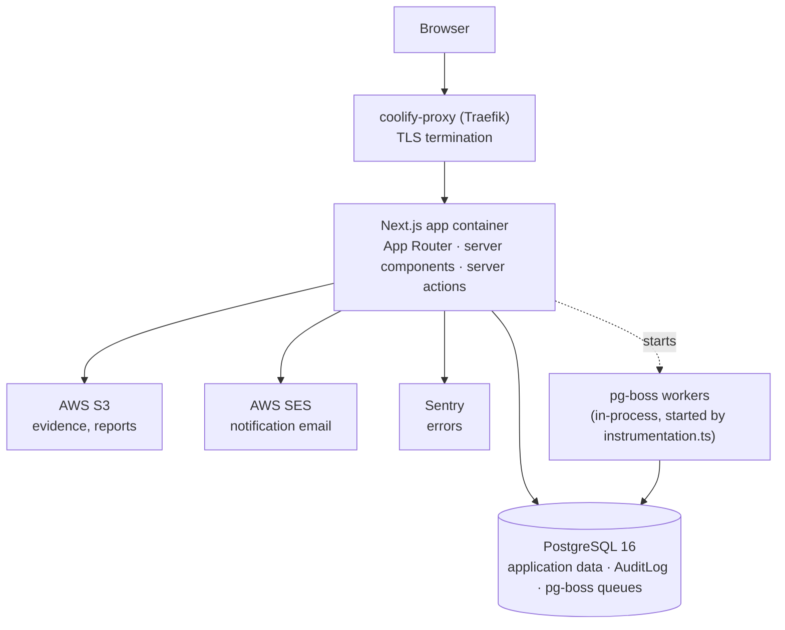
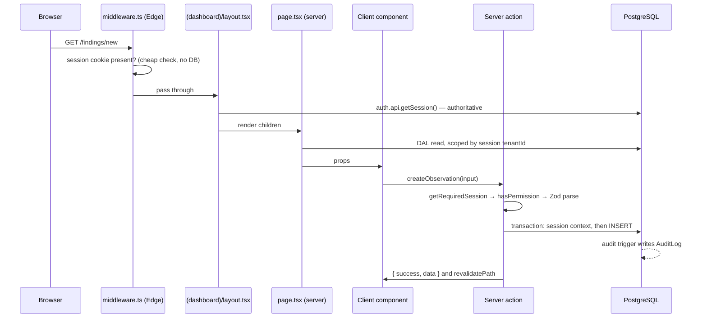
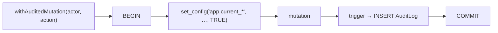
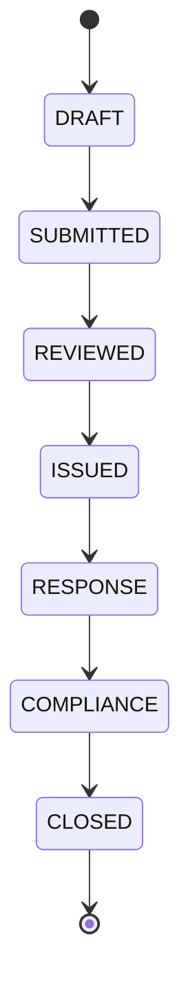

# Architecture

How AEGIS is put together, and the rules that hold it together.

This is a **hand-written** document about structure and intent. It deliberately
does not list tables, routes or actions — those are generated into
[`reference/`](reference/) from the source and will always be more current than
prose. Read this to understand _why_ the code is shaped the way it is; read the
reference to find out _what_ exists.

- **What exists** → [`reference/data-dictionary.md`](reference/data-dictionary.md),
  [`reference/routes.md`](reference/routes.md),
  [`reference/api-reference.md`](reference/api-reference.md),
  [`reference/data-flows.md`](reference/data-flows.md)
- **What it must do** → [`requirements/SRS.md`](requirements/SRS.md)
- **What the words mean** → [`../CONTEXT.md`](../CONTEXT.md)
- **How to run and release it** → [`../CLAUDE.md`](../CLAUDE.md), [`ops/`](ops/)

---

## Table of contents

- [The shape of the system](#the-shape-of-the-system)
- [Layers, and the rules between them](#layers-and-the-rules-between-them)
- [One request, end to end](#one-request-end-to-end)
- [Invariant 1 — tenant isolation](#invariant-1--tenant-isolation)
- [Invariant 2 — audit attribution](#invariant-2--audit-attribution)
- [Invariant 3 — authorization](#invariant-3--authorization)
- [Domain logic: pure engines](#domain-logic-pure-engines)
- [State machines](#state-machines)
- [Background jobs](#background-jobs)
- [Files, exports and email](#files-exports-and-email)
- [Internationalisation](#internationalisation)
- [Build and runtime configuration](#build-and-runtime-configuration)
- [Testing strategy](#testing-strategy)
- [Where the map is thin](#where-the-map-is-thin)
- [Adding a feature](#adding-a-feature)

---

## The shape of the system

A single Next.js App Router application, server-rendered, talking to one
PostgreSQL database. There is no separate API service, no message broker, no
cache tier. Everything that looks like infrastructure is either PostgreSQL or
AWS.



Two consequences worth internalising:

- **The job queue lives in the application database.** pg-boss uses the same
  `DATABASE_URL` as Prisma and its workers run inside the web container, started
  from `src/instrumentation.ts` on boot. There is no worker deployment to scale
  or restart separately — and equally, a job that wedges affects the web process.
- **S3 and SES are optional at boot.** `src/env.ts` marks every AWS variable
  `.optional()`, so the app starts without them; evidence upload and email are
  simply non-functional until they are configured. They do not fall back to a
  working local default, so a missing variable shows up as a broken feature, not
  a failed deploy.

## Layers, and the rules between them

| Layer             | Directory                              | Runs on         | May import                      |
| ----------------- | -------------------------------------- | --------------- | ------------------------------- |
| Pages & layouts   | `src/app/`                             | Server (mostly) | data-access, guards, components |
| API routes        | `src/app/api/`                         | Server          | data-access, lib                |
| Server actions    | `src/actions/`                         | Server          | data-access, lib, validations   |
| Data access (DAL) | `src/data-access/`                     | Server only     | `lib/prisma`, `lib/auth`        |
| Domain engines    | `src/lib/*-engine.ts`, `src/services/` | Anywhere        | Prisma **types** only           |
| Components        | `src/components/`                      | Server + client | UI primitives, types            |
| Jobs              | `src/jobs/`                            | Server (worker) | data-access, lib                |

The rules, in order of how much damage breaking them does:

1. **`src/data-access/` is `server-only`.** Every module opens with
   `import "server-only"`, which makes importing one from a `"use client"`
   component a build error rather than a leaked database handle. Import _types_
   from the DAL freely with `import type`; import functions never.
2. **Domain engines are pure.** `src/lib/*-engine.ts`, `state-machine.ts`,
   `instance-scoring.ts` and `src/services/risk-rating/` take plain values and
   return plain values. No Prisma client, no `fetch`, no clock beyond what is
   passed in. This is what makes them unit-testable without a database, and it
   is why every one of them has a test file while most of the rest of the code
   does not.
3. **Components do not fetch.** Server components call DAL functions and pass
   plain data down as props; client components receive props and call server
   actions. There is no data fetching inside a client component.
4. **Mutations go through server actions, not API routes.** The twelve HTTP
   endpoints under `src/app/api/` exist for things that fit HTTP better than a
   server action: Better Auth's handler, health, file downloads and streamed
   XLSX/PDF exports, an external cron trigger, and two JSON data endpoints the
   client fetches (`/api/dashboard`, `/api/is-audit/checklist` — both
   authenticated and tenant-scoped, so include them when auditing the HTTP
   surface). One exception to the rule itself:
   `POST /api/reports/board-report` is a mutation performed through an API
   route — it generates the PDF, writes it to S3 and records an audit entry —
   so changes to report permissions must cover it, not just `src/actions/`.

## One request, end to end

Creating an observation, as a worked example of the conventions:



Note the two-layer auth. `src/middleware.ts` runs in the Edge runtime and
therefore _cannot_ import `@/lib/auth` — Better Auth and Prisma pull in Node
built-ins that do not exist there. So middleware does an optimistic cookie
check for UX, and `(dashboard)/layout.tsx` does the authoritative session
validation before any child renders. **Middleware is not the security
boundary.** Deleting the middleware check would be a UX regression; deleting the
layout check would be a vulnerability.

Server actions return a discriminated result rather than throwing:

```ts
return { success: false as const, error: "…" };
return { success: true as const, data };
```

Callers branch on `success` and surface `error` in a toast. An action that
throws produces an opaque Next.js error digest in production, which is why the
convention exists.

## Invariant 1 — tenant isolation

**Tenant isolation is enforced in application code. PostgreSQL row-level
security is not enabled.**

This surprises people, because `prisma/migrations/add_rls_policies.sql` exists
and `prismaForTenant(tenantId)` reads like an RLS helper. Neither is what it
appears:

- The RLS migration file is present in the repository but **not applied** to the
  production database.
- `prismaForTenant()` validates that the tenant id is a well-formed UUID and
  returns the shared singleton client. It adds no filtering of its own.

It used to wrap every query in a transaction with `SET LOCAL`, which was a no-op
without policies _and_ caused P2028 transaction timeouts under parallel SSR load
— a dashboard fires 10–15 queries at once and they competed for pool
connections. That wrapping was removed (see the architecture note in
`src/lib/prisma.ts`).

What actually keeps tenants apart:

1. `tenantId` comes from `getRequiredSession()` and **nowhere else** — never
   from a URL parameter, request body or query string.
2. Every query carries an explicit `where: { tenantId }`. **This is the whole
   control.** The two things that sound like backstops are much weaker than
   they sound:
   - The read-side assertion ("throw if a returned row's `tenantId` doesn't
     match") exists in only ~8 of 51 DAL modules, and some of those return
     `null` instead of throwing. It is a spot check, not a net.
   - `src/data-access/__tests__/tenant-isolation.test.ts` is **advisory**: it
     checks that each DAL file contains the string `tenantId` somewhere, and
     its stricter checks (a `findMany` without a tenant filter, raw `prisma`
     imports) only `console.warn` — they cannot fail the build. It also never
     reads `src/actions/`, where most direct `prismaForTenant()` queries live.
     Unlike the audited-mutation discipline test, this one has no teeth.

So a dropped or forgotten `WHERE tenantId` is caught by **code review or
nothing**. Review every query in a DAL or action diff for the tenant predicate;
do not assume a test or assertion will flag it.

The full pattern, with examples, is in
[`src/data-access/README.md`](../src/data-access/README.md).

> If RLS is ever switched on, it consumes the same `app.current_tenant_id`
> setting the audit trigger already reads — it would be an additional layer, not
> a replacement for the `WHERE` clauses.

### The connection-pool trap

`src/lib/prisma.ts` exports the client through a `Proxy` that caches the
singleton on `globalThis` **unconditionally**. An earlier version cached only
outside production, which meant that under `next start` every property access
constructed a fresh `PrismaClient` with its own 25-connection pool — an unbounded
leak that exhausted PostgreSQL under load. Do not reintroduce a
`NODE_ENV`-conditional cache.

## Invariant 2 — audit attribution

Audited tables carry an `AFTER INSERT/UPDATE/DELETE` trigger that writes to
`AuditLog`. The trigger reads _who_ and _why_ from transaction-scoped PostgreSQL
session settings, so the mutation and its attribution must share a transaction:



`src/lib/session-context.ts` owns the contract — the six setting names, their
ordering, and how an `Actor` maps onto them. `src/data-access/audited-mutation.ts`
is the only sanctioned way to open such a transaction:

```ts
await withAuditedMutation(userActor(session), "observation.created", async (tx) => {
  return tx.observation.create({ data: { … } });
});

// Four actions are compiler-enforced to require a justification (DE6):
// finding.closed, user.role_changed, compliance.marked_na, observation.status_changed
await withAuditedMutation(actor, "finding.closed", fn, "Remediated in full");
```

Three details that matter:

- **An `Actor` is a user or the system.** Scheduled work uses
  `systemActor(tenantId)`, which deliberately leaves `app.current_user_id`
  _unset_ so the trigger records the platform acting under policy rather than
  attributing a change to a person who did not make it.
- **One transaction carries one tenant.** The context holds a single
  `app.current_tenant_id`, so cross-tenant work must group by tenant and call
  the wrapper once per group. Every job in `src/jobs/` loops tenants for exactly
  this reason.
- **Session GUCs read back as `''`, not NULL,** on a pooled connection that has
  previously set them, and `''::UUID` throws. Any SQL that reads one must wrap
  it in `NULLIF(current_setting(...), '')` — see
  `prisma/migrations/20260826_audit_trigger_null_safe.sql`.

A mutation made outside the wrapper writes an audit row with no attribution, and
historically did so in silence because callers wrap side effects in catch-alls.
`src/data-access/__tests__/audited-mutation-discipline.test.ts` therefore scans
the source and fails the build on any unwrapped write to an audited table.

**Legacy call sites.** Sixty-odd action files predate the wrapper and set the
context by hand via `setAuditContext` from `src/data-access/audit-context.ts`.
They work, and the discipline test allowlists them with a ceiling that may only
ever be lowered. New code must use `withAuditedMutation`; touching an
allowlisted file is a good opportunity to migrate it and lower the ceiling.

The list of audited tables lives in `src/lib/audit-triggers.ts` and must stay in
step with the trigger migrations. Note that a database built by `prisma db push`
alone has **no** triggers — they come from the non-Prisma SQL applied by hand.

## Invariant 3 — authorization

Roles are a Prisma enum (17 of them); permissions are a TypeScript union (78) in
`src/lib/permissions.ts`. Users hold an _array_ of roles, and their effective
permissions are the **union** across all of them, so every check is
`roles.includes(...)`-shaped, never `role === ...`.

Enforcement happens at three points, and all three are load-bearing:

| Point               | Mechanism                                                                       | What it protects                               |
| ------------------- | ------------------------------------------------------------------------------- | ---------------------------------------------- |
| Page                | `requirePermission(...)` / `requireAnyPermission(...)` from `src/lib/guards.ts` | Navigating to a route                          |
| Server action       | `hasPermission(session.user.roles, "…")` early return                           | Performing the mutation                        |
| Workflow transition | State-machine guards                                                            | Performing it _at this point in the lifecycle_ |

Page guards redirect to `/dashboard?unauthorized=true` rather than rendering a
403, so an unauthorized user lands somewhere useful.

The third row is the one that encodes maker-checker. Severity-based closing is
the clearest example: `AUDIT_MANAGER` may close LOW/MEDIUM observations,
`CAE` is required for HIGH/CRITICAL. That is a property of the transition, not
of the page, so it lives in `src/lib/state-machine.ts`.

> **Coverage is uneven.** 17 of 65 pages call a permission guard. The rest rely
> on the layout's session check plus action-level and DAL-level enforcement — so
> a user without permission cannot _do_ anything, but may be able to _load_ a
> page. See [Where the map is thin](#where-the-map-is-thin).

## Domain logic: pure engines

The regulatory arithmetic is isolated from I/O so it can be tested exhaustively
and reviewed against RBI policy without reading Prisma code.

| Module                            | Computes                                 | Rule of note                                                                                                                                                                         |
| --------------------------------- | ---------------------------------------- | ------------------------------------------------------------------------------------------------------------------------------------------------------------------------------------ |
| `lib/ram-engine.ts`               | Branch risk composite score              | Weighted average of 1–5 parameter scores, normalised by total weight. HIGH >3.5 → 12mo, MEDIUM 2.5–3.5 → 18mo, LOW <2.5 → 24mo audit frequency. Repeat findings apply a 1.5× uplift. |
| `lib/rbia-scoring-engine.ts`      | RBIA node → module roll-up               | 4-point scale (1.0 / 0.75 / 0.5 / 0.0). A critical item scored NON_COMPLIANT **caps** the module at 0.5 — a ceiling, not a floor.                                                    |
| `lib/instance-scoring.ts`         | Per-question compliance % → `ScoreLabel` | Bridges sample-based account responses into the RBIA scoring engine.                                                                                                                 |
| `lib/sampling-engine.ts`          | Deterministic sample selection           | Bucket-fill across five criteria buckets whose percentages must sum to 100.                                                                                                          |
| `lib/escalation-engine.ts`        | Overdue → escalation level               | L1 +15d, L2 +30d, L3 +90d, L4 +180d; L0 is within grace.                                                                                                                             |
| `lib/escalation-router.ts`        | Escalation level → recipients            | L1 Branch+IAD, L2 Zonal Auditor, L3 ACE Officer, L4 ACB Member + CAE.                                                                                                                |
| `services/risk-rating/compute.ts` | Engagement rating band                   | Inverted scale — fewer and lower-severity findings produce a _higher_ percentage.                                                                                                    |

`lib/repeat-finding-detector.ts` is the exception that proves the rule: it needs
the database (pg_trgm title similarity above 0.5, plus explicitly linked
`repeatOfId` records), so it is `server-only` and lives outside the pure set.

## State machines

Two lifecycles are modelled as explicit transition tables rather than status
strings scattered through actions.

**Observations** — `src/lib/state-machine.ts`, 7 states, 8 transitions
(6 forward, 2 returning):



**Engagements** — `src/lib/engagement-state-machine.ts`, 8 states:
`PLANNED → TEAM_ASSIGNED → OPENING_MEETING → IN_PROGRESS → EXIT_MEETING →
REPORT_DRAFT → COMPLETED`, with any non-terminal state able to reach
`CANCELLED`.

Engagement transitions carry **prerequisite guards** as well as role guards, so
the machine encodes audit practice: a team must be assigned before fieldwork,
meetings must be recorded before and after it, and the branch score must be
frozen before an engagement can complete.

Only the **engagement** machine is typed as `Record<EngagementStatus, …>`,
which means adding a status to that Prisma enum produces a TypeScript error
until the transition map is updated — do not widen the type to silence it. The
**observation** machine's `TRANSITIONS` is a flat `TransitionDef[]` with no
compile-time exhaustiveness: adding an `ObservationStatus` value builds
cleanly, and observations entering the new state simply have no available
transitions. When touching that enum, update the transition array by hand and
extend `src/lib/__tests__/state-machine.test.ts` to cover the new state.

## Background jobs

pg-boss queues and schedules live in `src/lib/job-queue.ts`; handlers live in
`src/jobs/` and are registered from `src/jobs/index.ts`. All cron is UTC; IST is
UTC+05:30.

| Job                     | Schedule (UTC) | Local         | Does                                                                                        |
| ----------------------- | -------------- | ------------- | ------------------------------------------------------------------------------------------- |
| `process-notifications` | `* * * * *`    | every minute  | Dequeues `NotificationQueue`, renders the template, sends via SES, marks SENT/FAILED        |
| `deadline-check`        | `30 0 * * *`   | 06:00 IST     | Observation deadline reminders at 7/3/1 days; also runs RBIA BM-response overdue escalation |
| `send-weekly-digest`    | `30 4 * * 1`   | Mon 10:00 IST | Per-tenant digest to CAE/CCO (who cannot opt out — regulatory)                              |
| `snapshot-metrics`      | `30 19 * * *`  | 01:00 IST     | Writes health score, compliance summary and severity breakdown into `DashboardSnapshot`     |

Queues retry 3 times with backoff and delete after 30 days. Conventions vary
more per job than you would hope:

- Every job iterates tenants, because one audited transaction carries one
  tenant. The deadline and escalation jobs wrap their writes in
  `withAuditedMutation(systemActor(tenantId), …)` once per tenant;
  `weekly-digest` wraps once per **recipient**; and `snapshot-metrics` uses no
  wrapper at all — legitimately, because `DashboardSnapshot` is not an audited
  table. Do not copy `snapshot-metrics` as a template for a job that writes an
  audited table.
- Reminder dedup checks `NotificationQueue` — not `EmailLog` — for a row of
  the same type for the same observation **created since local midnight**
  (`deadline-reminder.ts`). Purging old `NotificationQueue` rows re-arms the
  guard; conversely, a queued row whose SES send later fails still suppresses
  that day's retry.
- Only `snapshot-metrics` batches tenants (10 at a time) to protect the pool;
  the other jobs iterate tenants sequentially, so their runtime grows linearly
  with tenant count.

`/api/cron/escalation` exists as an external trigger for the same escalation
work, for environments where the in-process scheduler is not trusted to run.

## Files, exports and email

**Evidence upload** is presigned-PUT direct to S3; the application never proxies
file bytes. Keys are tenant-first by convention:

```
${tenantId}/evidence/${observationId}/${uuid}.${ext}
${tenantId}/bm-evidence/${actionPointId}/${uuid}.${ext}
${tenantId}/reports/${year}/${quarter}/${reportId}.pdf
```

**Download authorization** (`src/lib/authorize-download.ts`) is what makes that
convention a security control. It splits the key on `/` and compares the whole
first segment to the session's tenant id. The comparison is deliberately
segment-based rather than `startsWith`, because a prefix test would let tenant
`abc` match `abcdef/...`. One legacy namespace (`audit-reports/<tenantId>/…`) is
tenant-_second_ and has an explicit branch; that branch must not be removed
until the generators and stored keys are migrated.

**Exports** are streamed from API routes rather than server actions, because
they produce binary payloads: ExcelJS for XLSX, `@react-pdf/renderer` for PDF.
Both, plus `pg-boss`, are listed in `serverExternalPackages` in
`next.config.ts` — they do not survive bundling and must be required at runtime.

**Email** is React Email templates in `src/emails/`, rendered by the
notification processor and sent through SES. Nothing sends email synchronously
from a request; everything enqueues a `NotificationQueue` row and lets the
minute-ly worker deliver it.

## Internationalisation

`next-intl`, with the locale read from a `NEXT_LOCALE` cookie in
`src/i18n/request.ts` and validated against `["en", "hi", "mr", "gu"]` — an
unrecognised value silently falls back to `en`. There is **no locale path
segment**: URLs are identical across languages. Dictionaries are
`messages/<locale>.json`.

## Build and runtime configuration

- **Environment** is a single Zod schema in `src/env.ts`, imported by
  `next.config.ts` so validation runs at build time. Only four variables are
  required — `DATABASE_URL`, `BETTER_AUTH_SECRET` (min 32 chars),
  `BETTER_AUTH_URL`, `NEXT_PUBLIC_APP_URL`. `SKIP_ENV_VALIDATION=1` bypasses
  it for Docker builds where secrets are unavailable.
- **`NEXT_PUBLIC_*` variables are baked at build time**, so changing one
  requires a rebuild, not a restart.
- **Security headers** — CSP, HSTS, `X-Frame-Options: DENY`, `nosniff`,
  `Referrer-Policy` and a `Permissions-Policy` — are set for all routes in
  `next.config.ts`. The CSP allows `'unsafe-inline'` for scripts and styles and
  `'unsafe-eval'` in development only. The S3 origin is listed in both
  `img-src` and `connect-src`; the Sentry ingest origin is in `connect-src`
  only.
- **Server action body limit** is 5 MB.
- **Output** is `standalone` for Docker, but disabled under `CI` because
  `next start` is incompatible with standalone output in the E2E job.
- **Session** is Better Auth with database-backed sessions: 10 sign-ins per IP
  per 15 minutes, lockout after 5 failures for 30 minutes, at most 2 concurrent
  sessions per user, and `httpOnly` + `sameSite=lax` cookies with `secure`
  derived from whether `BETTER_AUTH_URL` is HTTPS.

## Testing strategy

| Kind       | Tool                    | Where                                              | Roughly                                                                                                                                        |
| ---------- | ----------------------- | -------------------------------------------------- | ---------------------------------------------------------------------------------------------------------------------------------------------- |
| Unit       | Vitest                  | `src/lib/__tests__/`, `src/services/**/__tests__/` | 284 cases in 10 files, concentrated on the pure engines and state machines                                                                     |
| Discipline | Vitest, static analysis | `src/data-access/__tests__/`                       | 101 cases in 2 suites that read source text, no database (whole Vitest run: 385 cases, 12 files)                                               |
| E2E        | Playwright              | `tests/e2e/`                                       | 2 spec files (observation lifecycle, permission guards) holding 30 cases, replayed under 5 role projects (auditor, manager, cae, cco, auditee) |

The two discipline suites are not equals. `audited-mutation-discipline.test.ts`
genuinely fails the build on an unwrapped write to an audited table, and its
allowlist is a ratchet — the count may only ever go down.
`tenant-isolation.test.ts` is **advisory** (see
[Invariant 1](#invariant-1--tenant-isolation)): its strict checks only warn, so
it keeps nothing from eroding on its own.

CI runs lint, typecheck, build, docker-build, unit-test and security-audit on
every pull request, **against the merge ref** — a green check reflects branch
plus `main` at that moment, not the branch alone.

## Where the map is thin

Documented honestly so nobody rediscovers these the hard way.

- **Permission guards cover 17 of 65 pages.** The remainder are protected by the
  layout session check and by action-level and DAL-level enforcement. Nothing
  unauthorized can be _performed_, but page-level coverage is not uniform.
- **63 action files still hand-roll `setAuditContext`** rather than using
  `withAuditedMutation`. They are correct but bypass the compiler's
  justification requirement for the four DE6 actions. The allowlist ceiling is
  67 and may only be lowered.
- **`prisma db push` alone produces an incomplete database.** Audit triggers,
  dashboard views, RBIA guards and notification tables come from loose `.sql`
  files in `prisma/migrations/` that are applied by hand and **do not ride along
  with a deploy**. Merging code that depends on one does not apply it.
- **RLS is written but not enabled.** `add_rls_policies.sql` exists; no policies
  are active. Treat any comment implying database-level isolation as
  aspirational.
- **The DAL layer is not uniformly used by actions.** Most server actions call
  `prismaForTenant()` directly rather than going through a
  `src/data-access/` function, so the DAL is a shared-query library rather than
  a strict gateway.
- **No automated check enforces `WHERE tenantId`.** The tenant-isolation test
  is advisory-only and never reads `src/actions/`, and the read-side assertion
  exists in a handful of modules. The tenant predicate is held up by code
  review alone — treat it as a mandatory review item on every query in a diff.
- **E2E coverage is two spec files** (30 cases). Lifecycle and permission
  guards are covered; most modules are not.
- **Deprecated demo JSON still ships in the bundle source.** `src/data/index.ts`
  exports seed JSON (`findings`, `auditPlans`, `bankProfile`, …) marked
  DEPRECATED. Tracing every consumer shows the chain is **orphaned** — the
  dashboard and report components that read it have no importers, and the live
  dashboard renders `components/dashboard/widgets/*` from database queries
  instead. No page serves demo data; the exports and their consumers are simply
  dead. Verify the import graph before assuming otherwise, and prefer deleting
  over reviving.

## Adding a feature

The path of least resistance, which is also the one the discipline tests expect:

1. **Schema** — edit `prisma/schema.prisma`, then `pnpm db:generate` and
   `pnpm db:push`. If the table should be audited, add it to `AUDITED_TABLES` in
   `src/lib/audit-triggers.ts` _and_ write the trigger migration.
2. **Pure logic first** — if there is arithmetic or a lifecycle rule, put it in
   `src/lib/` as a pure function with a test beside it. Do not let scoring rules
   grow inside a server action.
3. **Reads** — add a function to `src/data-access/`: `import "server-only"`,
   `getRequiredSession()`, `prismaForTenant(tenantId)`, explicit
   `where: { tenantId }`, assertion on the way out.
4. **Writes** — add a server action in `src/actions/<domain>/`: session,
   `hasPermission` check, Zod parse, then `withAuditedMutation(actor, "domain.event_past", …)`.
   Return `{ success, data }` / `{ success, error }`; never throw.
   `revalidatePath()` afterwards.
5. **Page** — a server component that calls `requirePermission()` and the DAL,
   passing plain data to client components. Use `@/*` aliases, import icons from
   `@/lib/icons`, compose classes with `cn()`.
6. **Permission** — if you added one, extend the `Permission` union and the
   `ROLE_PERMISSIONS` map in `src/lib/permissions.ts`.
7. **Verify** — `pnpm lint`, `pnpm test:unit` (the discipline tests run here),
   `pnpm build`, and `pnpm docs:reference` to refresh the generated reference.
