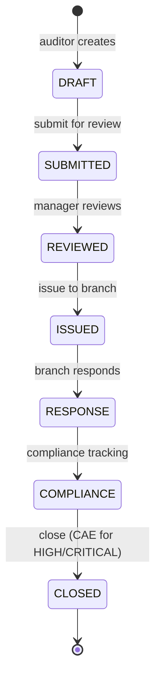
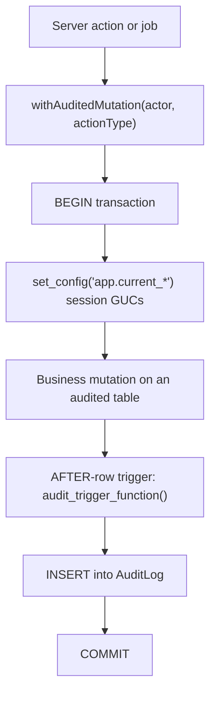

# Data Flows

> **Generated file — do not edit by hand.**
> Produced by `scripts/generate-reference-docs.mjs` from `prisma/schema.prisma`
> and the `src/` tree. Regenerate with `pnpm docs:reference`.
>
> Source commit: `2424f6f` (docs/reference-suite)

Which processes read and write which tables.

Derived by static analysis: each module is scanned for `prisma.<model>`,
`tx.<model>` and `db.<model>` accesses. This captures direct database access.
A module reaching a table indirectly — through a helper in `src/data-access/` —
is **not** shown here, so treat this as a map of direct access, not a complete
reachability graph.

## Process → table map

| Domain | Modules | Tables touched directly |
|---|---|---|
| `(root)` | 8 | `AuditLog`, `AuditeeResponse`, `Branch`, `Evidence`, `Observation`, `ObservationTimeline`, `Tenant`, `User`, `UserBranchAssignment` |
| `account-examination` | 1 | `AccountExamResponse`, `AuditEngagement`, `LoanAccount` |
| `admin` | 4 | `AuditCalendar`, `Branch`, `ReportTemplate`, `Zone` |
| `audit-execution` | 13 | `AuditEngagement`, `AuditExaminationResponse`, `AuditSectionInstance`, `AuditTeamMember`, `CashCheck`, `Evidence`, `ExaminationArea`, `ExaminationItem`, `LoanReview`, `Observation`, `ObservationTimeline`, `SmaNpaEntry` |
| `audit-plans` | 3 | `AuditEngagement`, `AuditPlan`, `Branch` |
| `compliance` | 7 | `BoardReport`, `ComplianceItem`, `NotificationQueue`, `Observation`, `User` |
| `concurrent-audit` | 4 | `ConcurrentAuditTemplate`, `NotificationQueue`, `Observation`, `ObservationTimeline`, `User` |
| `control-library` | 2 | `ControlLibrary`, `TestProcedure` |
| `examination-questions` | 1 | `ExaminationQuestion` |
| `governance` | 5 | `AuditEngagement`, `Branch`, `Committee`, `CommitteeMeeting`, `CommitteeMember`, `ComplianceItem`, `HousekeepingMetric`, `IsAuditChecklist`, `KeyRiskIndicator`, `Observation`, `PolicyDocument`, `RamAssessment`, `RegulatoryObservation`, `RiskRegister`, `User` |
| `housekeeping` | 1 | `HousekeepingMetric` |
| `investment` | 5 | `ApplicationInventory`, `InvestmentRecord`, `IsAuditChecklist`, `User`, `VendorRiskAssessment` |
| `issues` | 4 | `ActionPlan`, `Issue` |
| `loan-portfolio` | 3 | `AuditEngagement`, `LoanAccount` |
| `observations` | 3 | `ComplianceItem`, `Observation`, `ObservationTimeline` |
| `qa-assessment` | 2 | `Issue`, `QaSelfAssessment` |
| `ram` | 4 | `Branch`, `RamAssessment`, `RamAssessmentScore` |
| `rbia` | 5 | `ActionPoint`, `AuditEngagement`, `BmResponseBatch`, `BranchRbiaScore`, `EngagementMeeting`, `EngagementModuleSelection`, `Evidence`, `ExaminationNode`, `ExaminationResponse`, `Observation` |
| `regulatory` | 2 | `RegulatoryObservation` |
| `repeat-findings` | 2 | `Observation`, `ObservationTimeline` |
| `reports` | 4 | `AuditEngagement`, `BoardReport`, `Observation`, `ReportTemplate` |
| `risk-management` | 3 | `AuditUniverseEntity`, `KeyRiskIndicator`, `RiskAuditLinkage`, `RiskRegister` |
| `sampling` | 2 | `LoanAccount`, `SamplingConfig` |
| `work-program` | 3 | `AuditEngagement`, `ControlLibrary`, `TestProcedure`, `WorkProgramItem` |

## Background jobs

| Job | Audited | Tables touched directly |
|---|---|---|
| `deadline-reminder` | yes | `NotificationQueue`, `Observation`, `Tenant` |
| `notification-batcher` | — | — |
| `notification-processor` | yes | `NotificationQueue` |
| `overdue-escalation` | yes | `NotificationQueue`, `Observation`, `Tenant`, `User` |
| `rbia-overdue-escalation` | yes | `BmResponseBatch`, `NotificationQueue`, `Tenant`, `User` |
| `snapshot-metrics` | — | `DashboardSnapshot`, `Tenant` |
| `weekly-digest` | yes | `NotificationQueue`, `Observation`, `Tenant`, `User` |

## Most widely accessed tables

Tables reached from the greatest number of domains — the ones where a schema change carries the widest blast radius.

| Table | Domains | Reached from |
|---|---|---|
| `Observation` | 10 | `(root)`, `audit-execution`, `compliance`, `concurrent-audit`, `governance`, `jobs`, `observations`, `rbia`, `repeat-findings`, `reports` |
| `AuditEngagement` | 8 | `account-examination`, `audit-execution`, `audit-plans`, `governance`, `loan-portfolio`, `rbia`, `reports`, `work-program` |
| `User` | 6 | `(root)`, `compliance`, `concurrent-audit`, `governance`, `investment`, `jobs` |
| `Branch` | 5 | `(root)`, `admin`, `audit-plans`, `governance`, `ram` |
| `ObservationTimeline` | 5 | `(root)`, `audit-execution`, `concurrent-audit`, `observations`, `repeat-findings` |
| `LoanAccount` | 3 | `account-examination`, `loan-portfolio`, `sampling` |
| `Evidence` | 3 | `(root)`, `audit-execution`, `rbia` |
| `ComplianceItem` | 3 | `compliance`, `governance`, `observations` |
| `NotificationQueue` | 3 | `compliance`, `concurrent-audit`, `jobs` |
| `ReportTemplate` | 2 | `admin`, `reports` |
| `BoardReport` | 2 | `compliance`, `reports` |
| `ControlLibrary` | 2 | `control-library`, `work-program` |
| `TestProcedure` | 2 | `control-library`, `work-program` |
| `HousekeepingMetric` | 2 | `governance`, `housekeeping` |
| `IsAuditChecklist` | 2 | `governance`, `investment` |

## The observation lifecycle

The central workflow, and the tables each transition writes.

Every transition writes `Observation`, appends to `ObservationTimeline`, and — because both carry the audit trigger — inserts a row into `AuditLog`.

## The audited write path

How a mutation reaches the audit log.

The trigger reads the tenant, user, action and justification from PostgreSQL session settings that `withAuditedMutation` sets inside the same transaction. A mutation made outside that wrapper writes an audit row with no attribution — which is why the discipline test in `src/data-access/__tests__/` fails the build when a new unaudited write appears.
